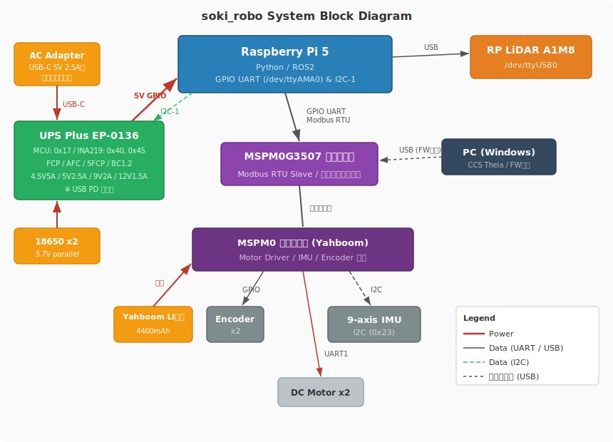

# soki_robo

自律走行ロボットプロジェクト。

## ディレクトリ構成

```
soki_robo/
├── requirements.txt  # Python 依存パッケージ (.venv 用)
├── setup.sh          # RPi セットアップスクリプト
├── lessons/          # レッスン（段階的に学習）
├── scripts/          # Python スクリプト (テスト・デーモン)
│   ├── test_mcu.py       # MCU 接続テスト
│   ├── test_lidar.py     # LiDAR 接続テスト
│   └── ups_monitor.py    # UPS バッテリー監視デーモン
├── examples/         # Jupyter ノートブック
│   ├── motor_test.ipynb   # モーター動作テスト
│   └── ups_monitor.ipynb  # UPS バッテリーモニター
├── services/         # systemd サービス管理
│   ├── install-services.sh
│   └── *.service.template
├── ros2_ws/          # ROS2 ワークスペース
│   └── src/
│       ├── soki_bringup/      # 起動・設定
│       ├── soki_description/  # URDF・モデル
│       ├── soki_hardware/     # ハードウェアインターフェース
│       └── soki_navigation/   # ナビゲーション
└── firmware/         # MSPM0 ファームウェア
    ├── soki_main/   # メインファームウェア（Modbus RTU スレーブ）
    ├── examples/     # 個別機能の実験用プロジェクト
    └── knowhow.md    # ファームウェア開発ノウハウ
```

## ハードウェア構成

- **シャーシ**: Yahboom MSPM0 シャーシキット（差動二輪）
  - **コアボード**: MSPM0G3507（リアルタイム制御、PC から USB で FW 書込）
  - **拡張ボード**: モータードライバ、IMU・エンコーダ接続、Li 電池入力
  - **Li 電池**: Yahboom 公式 4400mAh（拡張ボード・モーター電源）
- **メインボード**: Raspberry Pi 5（高レベル制御）
- **UPS**: 52Pi UPS Plus EP-0136（RPi 電源、I2C 監視）
  - 18650 x2、USB-C 充電（FCP/AFC/SFCP/BC1.2 対応、PD 非対応・5V フォールバックで充電可）
  - 入力: 4.5V 5A / 5V 2.5A / 9V 2A / 12V 1.5A
- **センサー**: エンコーダ x2、9軸IMU (0x23)、RP LiDAR A1M8

## システム構成



電源は2系統に分離している:
- **RPi 電源**: UPS Plus (18650 x2) → GPIO 5V で RPi に給電。USB-C で外部充電。
- **モーター電源**: Yahboom Li 電池 (4400mAh) → 拡張ボード → モータードライバ

RPi と MCU は GPIO UART で Modbus RTU 通信する（USB 逆流防止のため直結）。
RPi は I2C で UPS のバッテリー状態を監視し、低電圧時に安全シャットダウンを実行する。

| 接続 | インターフェース | 詳細 |
|------|-----------------|------|
| RPi ↔ MSPM0 コアボード | GPIO UART | RPi GPIO14/15 ↔ MCU PA26(TX)/PA25(RX), UART3, Modbus RTU |
| RPi ↔ UPS Plus | I2C-1 | MCU 0x17, INA219 0x40(supply), 0x45(battery) |
| RPi ↔ LiDAR | USB | /dev/ttyUSB0 |
| PC → MSPM0 コアボード | USB | ファームウェア書き込み (CCS Theia) |
| コアボード ↔ 拡張ボード | ピンヘッダ | UART1, I2C, GPIO 等 |
| 拡張ボード → Motor Driver | UART1 | PB6(TX)/PB7(RX) |
| 拡張ボード → IMU | I2C | 0x23 |
| 拡張ボード → Encoder x2 | GPIO | パルスカウント |
| UPS ← AC Adapter | USB-C | 5V 2.5A〜、急速充電対応 (FCP/AFC/SFCP/BC1.2) |
| UPS ← 18650 x2 | バッテリー | 3.7V 並列接続 |
| UPS → RPi | GPIO 5V | 電源供給 |
| Yahboom Li 電池 → 拡張ボード | バッテリー | 4400mAh、モーター電源 |

- **Python**: `pymodbus` で MCU と直接通信、`smbus2` / `pi-ina219` で UPS 監視
- **ROS2**: C++ ブリッジノードが Modbus RTU でやり取りし、ROS2 トピックに変換
