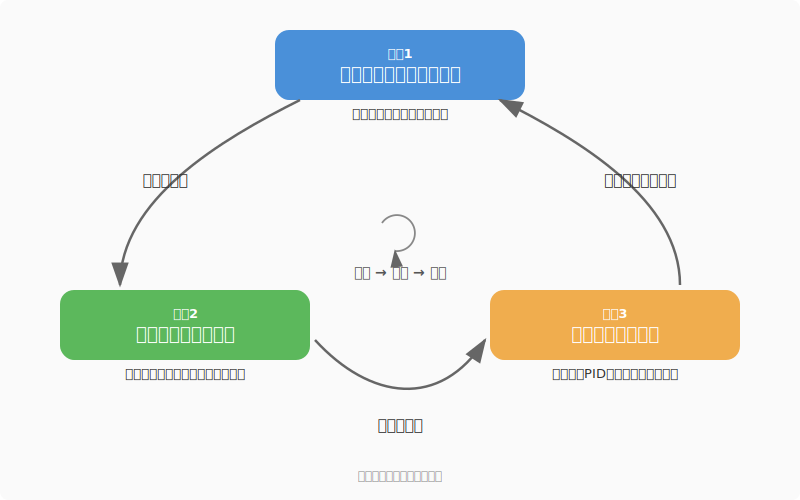

# このレッスンについて

## このレッスンの目的

このレッスンは、大学で教わることの **「意味」と「用途」** を先に伝えるためのものです。

大学に入ると、数学の授業でいきなり三角関数の公式や行列の計算が始まります。
多くの学生が「これ、何に使うの？」と思いながら授業を受けることになります。

このレッスンでは、その答えを先に渡します。

- 三角関数 → ロボットで「斜め」を考えるときに使う
- 線形代数 → センサの値を「まとめて変換」するときに使う
- 微積 → ロボットの「変化」を扱うときに使う
- 確率 → 過去のデータから「今どこにいるか」を推定するときに使う

「何に使うか」が分かっていれば、大学の授業で公式や理論が出てきたときに
「ああ、あのときの話の裏側はこうなってたのか」と繋がります。

> **重要**: このレッスンは大学の授業を **置き換えるものではありません**。
> 頭出しをしておくことで、大学の授業の理解がより深くなるための準備です。

---

## 深度の宣言 — どこまでやるか

このレッスンでは、わざと**難しいことを簡単に伝えます**。

具体的には、以下が到達ラインです:

1. **計算の仕組みを知る** — 手で一度やってみて「こういう計算なんだ」と分かる
2. **numpyで書ける** — Pythonで1行で計算できる
3. **結果の意味が分かる** — 出てきた数字が何を意味しているか説明できる

ここまで出来れば **OK** です。

逆に、以下は **このレッスンではやりません**:

- 公式の暗記
- 手計算の習熟（速く正確に解けるようになること）
- 定理の証明
- ε-δ論法のような厳密な定義

これらは全部、大学で体系的にやります。
大学の授業には大学の順番で教える理由があり、そこで学ぶことに大きな意味があります。

> **「大学でやる数学は不要」ではなく「大学でやる数学がもっと分かるようになる」がゴール。**

---

## 3つの大枠 — レッスンの構成

このレッスンは3つの大きな枠で構成されています。

<!-- fig_cycle.svg: 3大枠のサイクル図 -->


### 大枠1: ロボットを触る（体験）

実際にロボットを動かして、センサを読んで、データを見ます。

- 車輪を回して動かす
- エンコーダ、IMU、LiDARでセンサの値を読む
- Pythonで計算し、matplotlibでグラフにする

「自分が書いたコードでロボットが動く」という体験が最初のステップです。

### 大枠2: 工学的数学（道具）

ロボットを扱うために必要な数学を、**道具として** 学びます。

| 科目 | 一言（ロボット工学での使い方） |
|------|-------------------------------|
| 三角関数 | 斜めを考える道具 |
| 線形代数 | まとめて変換する道具 |
| 微積 | 変化を扱う道具 |
| 確率 | 過去の観測から今を推定する道具 |

> **注意**: この一言は「ロボット工学でこの数学をどう使うか」であって、
> 数学としての正式な定義ではありません。正式な定義は大学で学びます。
> ここでは意味と使い方だけ。

### 大枠3: 工学演算（応用）— ボーナスステージ

大枠1と2で得た知識を組み合わせて、工学的な計算をやってみます。

- 差動二輪の運動学（行列で車輪速度と機体速度を変換する）
- ホイールオドメトリ（エンコーダから位置を推定する）
- PID制御（微積を使った速度制御）
- 相補フィルタ、状態方程式、カルマンフィルタ

ここからは大学で本格的にやる内容の予告編です。
全部は分からなくても全然OKで、名前を聞いたことがあるだけでも違います。

---

## 学び方 — 体験→道具→応用のサイクル

3つの大枠を順番にやるのではなく、**交互に行ったり来たり** しながら進みます。

```
体験: 車輪を回してみる
  ↓ 「なぜ斜めに進むの？」
道具: 三角関数を学ぶ
  ↓ 「これでロボットの動きが計算できるんだ」
応用: 差動二輪の運動学
  ↓ 「もっと正確に動かしたい！」
体験: エンコーダを読んでみる
  ↓ 「ズレていくんだけど...」
道具: 確率を学ぶ
  ↓ ...
```

数学だけ延々やることはありません。
「ロボットを触る → 必要な道具を学ぶ → 道具を使ってみる」を繰り返します。
だから「何のためにやっているのか分からない」状態にはなりません。

---

## 大学との関係

### このレッスンと大学の授業の違い

| | このレッスン | 大学の授業 |
|---|------------|-----------|
| 目的 | 「何に使うか」を知る | 「なぜそうなるか」を理解する |
| 深さ | 概念と使い方 | 理論と証明 |
| 計算 | numpyで書ければOK | 手計算で導出できる |
| 順序 | ロボットで使う順 | 数学の体系順 |

どちらが正しいということではなく、**両方の視点を持つ方が強い** です。

大学の授業で教える順序にも理由があります。
たとえば微積は三角関数の後に教えますが、それは微分の中でsin/cosが登場するからです。
このレッスンでは先にロボットで必要な順番で教えますが、
大学の順番を知ったとき「あ、だからこの順番なのか」と分かるとなお良いです。

### 大学で待っているもの

各科目の終わりに「大学ではここから先にこういう世界がある」を少しだけ見せます。
全部理解する必要はなく、「へえ、そういうのがあるんだ」でOKです。

大学に入ったとき、教授が黒板に書き始めた式を見て
「あ、これ聞いたことある」と思えたら、このレッスンは成功です。

---

## 生成AIの位置づけ

計算は生成AIに任せられる時代になりました。
行列の掛け算も、微分も、統計処理も、AIに頼めば一瞬で答えが返ってきます。

でも、**原理を知らないと、AIの出力が正しいか判断できません**。

- AIが出した回転行列、向きは合ってる？
- AIが計算したPIDゲイン、この条件で安定する？
- AIが推定した位置、この誤差は妥当？

「原理を極める」必要はありません。
でも「何をやっているか」「結果がおかしいときに何がおかしいか」を
判断できる **観点** は、自分の中に持っている必要があります。

このレッスンが目指すのは、まさにその観点を作ることです。

---

## まとめ

- **目的**: 大学の数学が「何に使うか」を先に知る。大学の授業がもっと分かるようになる
- **深さ**: 仕組みを知る → numpyで書ける → 結果の意味が分かる。それ以上は大学で
- **構成**: 体験（ロボット）→ 道具（数学）→ 応用（工学演算）のサイクル
- **大学との関係**: 置き換えではなく頭出し。両方の視点を持つ方が強い
- **生成AI**: 計算は任せられるが、判断する観点は自分に必要

---

**次のレッスン**: → #01 全体地図 (`01_experience/01_roadmap`)
