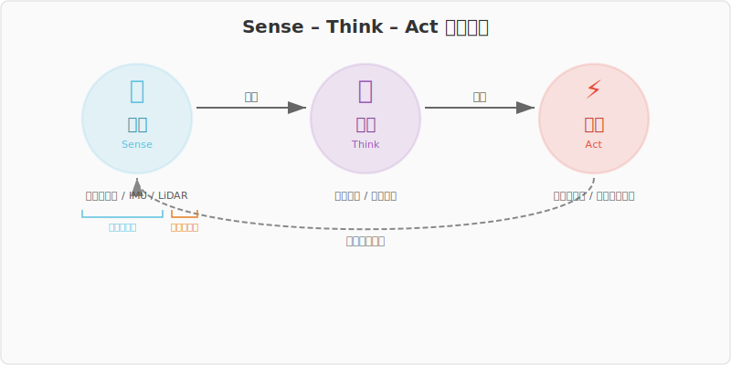

# 全体地図

**目的**: これからやることの全体像を見せる。地図があれば迷わない。

---

## 認知・判断・制御

ロボットがやっていることは、突き詰めると **3つ** に分かれます。

<!-- fig_sense_think_act.svg: 認知・判断・制御のサイクル図 -->


### 制御（Act）— 動く

ロボットに「こう動け」と命令を出すこと。

- 車輪を回す
- 速度を変える
- 旋回する、停止する

「自分が書いたコードでロボットが動く」は制御の体験です。
制御は一番分かりやすいので、最初にここから始めます。

### 認知（Sense）— 知る

センサで自分と周囲の状態を知ること。

- **内界センサ**: 自分の状態を知る
  - エンコーダ: 車輪がどれだけ回ったか
  - IMU: 自分がどんな姿勢か、どんな加速度を受けているか
- **外界センサ**: 周りの環境を知る
  - LiDAR: 周囲に何がどのくらいの距離にあるか

なぜ両方必要か？

- 内界センサだけだと「自分がどれだけ動いたか」は分かるが、壁にぶつかる
- 外界センサだけだと「周りに何があるか」は分かるが、自分がどこにいるか分からない
- 両方を組み合わせて初めて「自分がどこにいて、周りに何があるか」が分かる

### 判断（Think）— 決める

認知した情報を元に「次にどう動くべきか」を決めること。

- 障害物があったら避ける
- 目標地点に向かって経路を選ぶ
- 速度を調整する

判断は一番難しい部分で、大枠3（工学演算）で扱います。
今は「こういう段階があるんだ」と知っておけば十分です。

---

## 座標系 — 「どこから見ているか」

ロボットを扱ううえで、もう一つ根っこにある概念があります。**座標系** です。

### なぜ座標系が重要か

センサが見ている世界と、ロボットが動いている世界は **同じではありません**。

- **世界座標系**: 人間から見た空間。北が上、東が右。動かない
- **ロボット座標系**: ロボットから見た空間。前が「前」、右が「右」。ロボットが回ると一緒に回る
- **センサ座標系**: センサから見た空間。センサの取り付け位置・向きに依存する

たとえば、ロボットが北を向いているとき「前方1m」は世界座標系では「北方1m」です。
でもロボットが東を向いたら「前方1m」は「東方1m」になります。
**同じ「前方1m」なのに、世界から見た位置は違う。**

この「見ている方向が違うと同じデータでも意味が違う」問題を解決する道具が、
大枠2で学ぶ**線形代数（座標変換）**です。

### 体験で感じる座標系

大枠1でセンサを触ると、この「ズレ」を肌で感じることになります。

- IMUの値とロボットの向きが合わない → センサ座標系とロボット座標系のズレ
- LiDARのデータがロボットを回すと向きが変わる → ロボット座標系と世界座標系のズレ

最初は「なんかズレてる」でOKです。
そのズレを数式で解決する道具が、後で出てきます。

---

## 次元 — 2Dと3D

このレッスンで扱うロボットは **差動二輪ロボット**（車輪が2つ付いた台車型のロボット）です。

- **2D（平面）**: 差動二輪ロボットは床の上を動く。前後・左右・回転の3自由度
- **3D（空間）**: ドローンやロボットアームは空間を動く。もっと自由度が多い

このレッスンでは基本的に **2D** で考えます。
2Dで身につけた考え方は3Dにそのまま拡張できるので、2Dを理解していれば十分です。

**自由度** という考え方:
- 差動二輪: 平面上の位置(x, y)と向き(θ)の3自由度
- 「何個の数字があればロボットの状態を完全に表せるか」= 自由度の数

---

## このレッスンの全体構成

### 3大枠の関係

```
大枠1: ロボットを触る（体験）
  → 「これ、なんで？」「どう計算するの？」

大枠2: 工学的数学（道具）
  → 「なるほど、この道具を使えばいいのか」

大枠3: 工学演算（応用）
  → 「道具を使って、実際にやってみよう」
```

3つを行ったり来たりしながら進むので、数学だけ延々やることはありません。

### 深度の確認

このレッスンで目指すのは:

- 概念の名前と意味が分かる
- numpyで計算できる
- 結果の意味を説明できる

**全部をマスターするわけではありません。意味と使い方だけ。**

大学では、ここで触れた概念の「なぜそうなるか」と「正確にどうやるか」を学びます。
ここで得た「何に使うか」の知識があれば、大学の授業がぐっと分かりやすくなります。

---

**次のレッスン**: → #02 Python基礎 (`01_experience/02_python_basics`)
