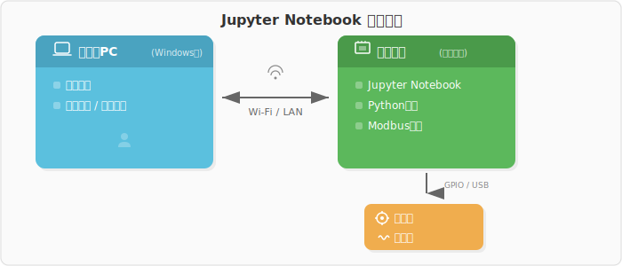

# Python基礎

**目的**: Pythonを電卓として使えるようにする。プログラミングを教えるのではない。

---

## なぜPythonか

プログラミング言語というと難しそうに聞こえますが、
ここでは **めちゃくちゃ賢い電卓** として使います。

Pythonを選んでいる最大の理由は **対話的に動かせる** こと。

- 1行書いて実行 → 即座に結果が出る
- `set_speed(100, 100)` → ロボットが動く
- `read_encoder()` → センサの値が返ってくる

**書いた瞬間にロボットが動く。** これがPythonを使う理由です。
C言語のように「コンパイルして、転送して、実行して…」ではなく、
1行書くたびに結果が見える。電卓感覚でロボットを操作できます。

---

## 環境

### パッケージ — 他の人が作った道具を借りる

Pythonには「パッケージ」という仕組みがあります。
誰かが作って公開してくれた便利な道具（ライブラリ）をインストールして使えます。

```bash
pip install pymodbus   # Modbusで通信するためのパッケージ
pip install numpy      # 数値計算のパッケージ
```

このプロジェクトでは `pymodbus`（ロボットとの通信）、`numpy`（数値計算）、
`matplotlib`（グラフ描画）などを使います。
これらは最初から入っているわけではなく、`pip` というコマンドでインストールします。

### venv — パッケージの置き場所を分ける

パッケージはインストールするとPythonの中に置かれます。
ところが、プロジェクトごとに必要なパッケージやバージョンが違うことがあります。
全部を一箇所に入れると、あるプロジェクトのパッケージが
別のプロジェクトに影響してしまう（「汚染」する）ことがあります。

そこで **venv（仮想環境）** を使います。
プロジェクト専用のパッケージ置き場を作って、そこにだけインストールする仕組みです。

```
soki_robo/
└── .venv/          ← このプロジェクト専用のパッケージ置き場
    └── bin/
        ├── python  ← この Python は .venv の中のパッケージを見る
        └── pip     ← ここで pip install すると .venv に入る
```

venvを使うには、ターミナルで **activate** します:

```bash
source .venv/bin/activate   # venvを有効にする
python3                      # .venv のパッケージが使える
```

activate すると、プロンプトの先頭に `(.venv)` が表示されます。
この状態なら pymodbus も numpy も使えます。
activate していない状態だと、pymodbus のようにvenvにしか入っていない
パッケージは見つかりません。

> **このプロジェクトのルール**: ラズパイで Python を使うときは、
> まず `source .venv/bin/activate` する。

### Jupyter と venv の関係

Jupyter Notebook もこの venv の上で動いています。
だから Jupyter のセルで `import pymodbus` や `import numpy` が使えるのは、
venv にインストールされたパッケージを見ているからです。

### ラズパイ上のJupyter Notebook（メイン環境）

ロボット（ラズパイ）上でJupyterを起動しておき、
手元のPC（Windows等）のブラウザからアクセスして使います。

<!-- fig_jupyter_setup.svg: 実験環境の構成図 -->


手元のブラウザでセルを実行すると、ラズパイ上でPythonが動き、
ロボットに速度指令を送ったりセンサの値を読んだりできます。
コードと結果がセルに残るので、後から見返すのにも便利です。

ロボットを触るレッスン（大枠1・大枠3）では基本的にこの構成を使います。

### REPL — もう一つの対話モード

ラズパイにSSHして、venvを有効にしてから `python3` と打てば、
ターミナル上でも対話的にPythonが使えます。

```bash
source .venv/bin/activate   # まずvenvを有効にする
python3                      # REPLが起動する
```

```python
>>> from pymodbus.client import ModbusSerialClient
>>> client = ModbusSerialClient(port='/dev/ttyUSB0', baudrate=115200)
>>> client.connect()
True
>>> client.write_registers(0x40, values=[100, 100], device_id=1)  # ロボットが動く
>>> client.write_registers(0x40, values=[0, 0], device_id=1)      # 停止
```

Jupyterを立ち上げるまでもない「ちょっと動かしたい」ときに便利です。
次のレッスンで `set_speed()` や `read_encoder()` といった便利関数を作るので、
実際にはもっとシンプルに書けるようになります。

### 数学だけのとき（大枠2の練習）

ロボットを繋がない計算だけの場面では、以下のどちらでもOKです。

| 環境 | 特徴 |
| ---- | ---- |
| ラズパイのJupyter | ロボットのときと同じ環境。切り替え不要 |
| Google Colab | ブラウザだけで動く。ラズパイ不要。numpy/matplotlib入り |

ColabのバックエンドはJupyterなので操作感は同じです。

### REPL（リプル）の基本

```python
>>> 1 + 2
3
>>> 3.14 * 2
6.28
>>> 100 / 3
33.333333333333336
```

書いた瞬間に答えが出ます。電卓そのものです。
「ちょっと計算したい」だけならこれで十分です。

---

## 最低限の文法

### 変数 — 値に名前をつける

```python
speed = 0.5          # 速度 [m/s]
radius = 0.033       # 車輪の半径 [m]
distance = speed * 3  # 3秒間の移動距離
print(distance)       # 1.5
```

`=` は「等しい」ではなく「右辺を左辺の名前で覚えておけ」という命令です。

### リスト — 値の並び

```python
sensor_data = [10, 12, 11, 13, 10]
print(len(sensor_data))  # 5（データ数）
print(sensor_data[0])    # 10（最初の値）
print(sensor_data[-1])   # 10（最後の値）
```

センサから読み取ったデータは、だいたいリスト（数字の並び）で扱います。

### ループ — 繰り返し

```python
for i in range(5):
    print(i)
# 0, 1, 2, 3, 4 が順番に表示される
```

センサの値を1つずつ処理するとき、ループを使います。

### 関数 — 処理をまとめる

```python
def wheel_speed_to_distance(speed, dt):
    return speed * dt

d = wheel_speed_to_distance(0.5, 3.0)
print(d)  # 1.5
```

同じ計算を何度もやるとき、名前をつけてまとめておくと便利です。

---

## 確認するための道具

### print() — 値を表示する

```python
x = 42
print(x)        # 42
print(x * 2)    # 84
```

「今、この値はいくつだろう？」と思ったら `print()` で確認します。

### type() — 型を確認する

```python
print(type(42))      # <class 'int'>    ← 整数
print(type(3.14))    # <class 'float'>  ← 小数
print(type("hello")) # <class 'str'>    ← 文字列
```

計算がうまくいかないとき、値の「型」が原因のことがあります。
`type()` で「この値は何者か」を確認できます。

---

## ここで覚えること

- Pythonは賢い電卓。書いて実行すれば答えが出る
- 変数: 値に名前をつける
- リスト: 値の並び（センサデータはだいたいこれ）
- ループ: 繰り返し
- 関数: 処理をまとめる
- `print()` と `type()` で確認する

プログラミングの深い話は必要になったときにやります。
今は「計算したいことをPythonで書ける」状態になればOKです。

---

**次のレッスン**: → #03 車輪を回す (`01_experience/03_wheel_control`)
