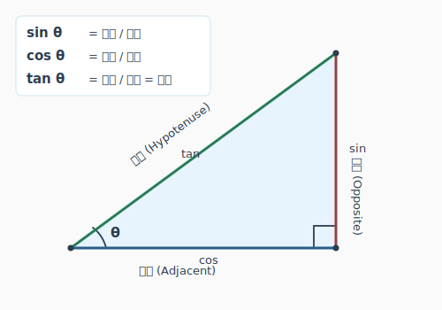

# 三角関数 —「斜めを考える道具」

> **大枠2 冒頭宣言**: ここで説明する一言は「ロボット工学でこの数学をどう使うか」であって、
> 数学としての正式な定義ではありません。正式な定義は大学で学びます。
> ここでは意味と使い方だけ。計算は仕組みを知ればOK、習熟は大学で。

---

## sin / cos / tan の直感

**ゴールライン**: 角度から高さ・底辺・傾きが出せることが分かる。逆も分かる。

### 直角三角形での理解

<!-- fig_right_triangle.svg: sin/cos/tanの直角三角形図 -->


角度θがあるとき:

| 関数 | 意味 | 式 |
| ---- | ---- | -- |
| sin θ | 高さの比 | 対辺 / 斜辺 |
| cos θ | 底辺の比 | 隣辺 / 斜辺 |
| tan θ | 傾きの比 | 対辺 / 隣辺 |

**sin/cos/tanは同じ事象の違う側面** です。
同じ三角形を見ているのに、「高さに注目」「底辺に注目」「傾きに注目」の違い。

### arc — 逆操作

`arc` が頭につくと、逆方向の操作になります。

- sin: 角度 → 高さの比
- **arcsin**: 高さの比 → 角度

```python
import numpy as np

# 角度(30°) → sinの値
print(np.sin(np.radians(30)))  # 0.5

# sinの値(0.5) → 角度
print(np.degrees(np.arcsin(0.5)))  # 30.0
```

「値が分かっていて角度が知りたい」ときに使います。

### 単位円への接続

「比」と言ったけど、実は sin/cos はもっとシンプルに考えられます。

**半径1の円（単位円）の座標**:
- 角度θのとき、円周上の点は `(cos θ, sin θ)`
- つまり cos θ = x座標、sin θ = y座標

直角三角形の「比」は、斜辺を1にしたときの高さと底辺そのものです。

```python
import numpy as np
import matplotlib.pyplot as plt

theta = np.linspace(0, 2*np.pi, 100)
x = np.cos(theta)
y = np.sin(theta)

plt.figure(figsize=(6, 6))
plt.plot(x, y)
plt.plot([0, np.cos(np.radians(45))], [0, np.sin(np.radians(45))], 'r-', linewidth=2)
plt.scatter(np.cos(np.radians(45)), np.sin(np.radians(45)), s=50, c='red', zorder=5)
plt.text(0.5, 0.55, f"(cos45°, sin45°)\n≈(0.71, 0.71)", fontsize=10)
plt.axis('equal')
plt.grid(True)
plt.title("Unit circle")
plt.show()
```

> **大学チラ見せ**: 大学では加法定理、三角関数の合成、級数展開（テイラー展開）とかが出てきます。
> ここでは「角度から座標が出せる、座標から角度が出せる」が分かればOK。

---

## norm と正規化

**ゴールライン**: 長さの求め方と、方向だけ取り出す操作が分かる。numpyで書ける。

### norm = ベクトルの長さ

「三平方の定理」を覚えていますか？

```
斜辺² = 底辺² + 高さ²
斜辺 = √(底辺² + 高さ²)
```

これをベクトルに適用したのが **norm**（ノルム）です。

```python
v = np.array([3, 4])
length = np.linalg.norm(v)
print(length)  # 5.0  ← √(9+16) = √25 = 5
```

norm = ベクトルの長さ = 三平方の定理の延長。それだけです。

### 正規化 = 方向だけ取り出す

ベクトルをnormで割ると、長さが1になります。

```python
v = np.array([3, 4])
unit_v = v / np.linalg.norm(v)
print(unit_v)                    # [0.6, 0.8]
print(np.linalg.norm(unit_v))   # 1.0  ← 長さ1
```

**「大きさ」を捨てて「方向」だけ取り出す操作** = 正規化（ノーマライズ）。

### ユークリッド距離

2点間の距離 = 2点を結ぶベクトルのnorm。

```python
p1 = np.array([1, 2])
p2 = np.array([4, 6])
distance = np.linalg.norm(p2 - p1)
print(distance)  # 5.0
```

これが「ユークリッド距離」です。普段言う「距離」はだいたいこれ。

### いろんなノルム（へーレベル）

実はノルムは1種類じゃありません。

| 名前 | 何を計算する | 用途 |
| ---- | ------------ | ---- |
| L2ノルム（ユークリッド） | √(x² + y²) | 普通の距離。ロボットでは9割これ |
| L1ノルム（マンハッタン） | \|x\| + \|y\| | 格子状に動く場合の距離 |
| L∞ノルム | max(\|x\|, \|y\|) | 各成分のうち最大のもの |

```python
v = np.array([3, 4])
print(np.linalg.norm(v, ord=2))    # 5.0   ← L2
print(np.linalg.norm(v, ord=1))    # 7.0   ← L1
print(np.linalg.norm(v, ord=np.inf))  # 4.0 ← L∞
```

ロボットではほぼL2（ユークリッド）を使います。「へー、他にもあるんだ」でOK。

---

## rad の概念

**ゴールライン**: なぜdegではなくradを使うかが分かる。

### 度（deg）vs ラジアン（rad）

- 度: 1周 = 360°。人間に分かりやすい
- ラジアン: 1周 = 2π。計算に都合がいい

### なぜradを使うのか

正規化の延長として考えると分かりやすいです。

- 半径1の円（単位円）の弧の長さ = 角度(rad)
- 半径rの円弧 = r × θ(rad)

つまり **radなら、角度と長さが直接つながります**。

ロボットの場合:
- ホイールオドメトリで rad なら単位変換が不要
- 旋回半径と速度が比例する式が自然に書ける
- 三角関数の引数は rad（numpyも rad を使う）

```python
np.sin(np.pi / 6)     # 0.5  ← 30° = π/6 rad
np.sin(np.radians(30)) # 0.5 ← こっちでもOK
```

`np.radians()` と `np.degrees()` で相互変換できるので、暗記は不要です。

> **大学チラ見せ**: 微積で rad じゃないと微分が壊れます（d/dθ sin θ = cos θ が成り立たない）。
> 大学で微積をやると「だからradなのか」と腑に落ちます。

---

## 大学で躓きやすいポイント

加法定理・積和変換の公式暗記を大量に求められます。
公式の意味が分からないまま計算ドリルになりがちです。

「この公式は何をやっているのか」を構造で考える視点があると、
公式暗記の苦痛が大幅に減ります。

## 今は分かってなくて当然

- sin/cosがなぜ波の形になるのか
- 加法定理の証明
- 三角関数の級数展開（テイラー展開）

ここでは「斜めを扱う道具」として使えればOKです。
大学で上記の理論を学んだとき、ここで得た直感が土台になります。

---

**次のレッスン**: → #07 エンコーダを読む (`01_experience/04_encoder`)
