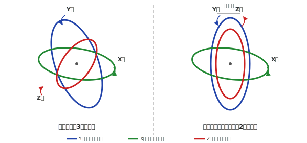

# 線形代数 —「まとめて変換する道具」

---

## 行列の計算体験

**ゴールライン**: 行列の掛け算の仕組みを知っている。めんどくさいことも知っている。

### 2×2行列の掛け算を手でやってみる

```
(1  2)   (5)   (1×5 + 2×6)   (17)
(    ) × ( ) = (           ) = (  )
(3  4)   (6)   (3×5 + 4×6)   (39)
```

やり方:
1. 行列の1行目の各要素と、ベクトルの各要素を掛ける
2. それを足す → 結果の1つ目
3. 行列の2行目でも同じ → 結果の2つ目

**めんどくさいでしょ？**

numpyなら:

```python
import numpy as np
A = np.array([[1, 2],
              [3, 4]])
v = np.array([5, 6])
print(A @ v)  # [17 39]
```

1行で終わります。

### 行列同士の掛け算

```python
A = np.array([[1, 2], [3, 4]])
B = np.array([[5, 6], [7, 8]])
print(A @ B)
# [[19 22]
#  [43 50]]
```

**順番が大事**: `A @ B` と `B @ A` は結果が違います。

```python
print(B @ A)
# [[23 34]
#  [31 46]]  ← 違う！
```

行列の掛け算は **順番を入れ替えてはいけない**。これは重要です。

---

## 構造で見る

**ゴールライン**: 行列の掛け算を「出力 = 変換 × 入力」として読める。

### さっきの計算を構造で見直す

```
出力 = 変換 × 入力

(17)   (1  2)   (5)
(  ) = (    ) × ( )
(39)   (3  4)   (6)
```

- **入力**: 右側のベクトル。「元のデータ」
- **変換**: 真ん中の行列。「どう変えるかのルール」
- **出力**: 左側のベクトル。「変換された結果」

### 行と列の意味

- **行**: 出力の各成分がどう計算されるか
  - 1行目 `[1, 2]` → 出力の1成分目は「入力の1成分目×1 + 入力の2成分目×2」
- **列**: 入力の各成分がどう寄与するか
  - 1列目 `[1, 3]` → 入力の1成分目が出力にどう効くか

### 単位行列 — 「何もしない変換」で仕組みを理解する

**ゴールライン**: 単位行列を基準にして、任意の行列が「何をしている変換か」を列から読める。

行と列の意味が分かったところで、一番シンプルな行列を見てみましょう。

```
(1  0)   (5)   (1×5 + 0×6)   (5)
(    ) × ( ) = (           ) = ( )
(0  1)   (6)   (0×5 + 1×6)   (6)
```

入力がそのまま出てきました。これが **単位行列 I** です。

列の意味で読むと:
- 1列目 `[1, 0]` → 入力の1成分目は、出力の1成分目に **1倍**、2成分目に **0倍** で寄与
- 2列目 `[0, 1]` → 入力の2成分目は、出力の1成分目に **0倍**、2成分目に **1倍** で寄与

「対応する成分にそのまま渡して、他には何もしない」。これが **何もしない変換** です。

では、さっきの行列 `[[1, 2], [3, 4]]` と比べてみましょう:
- 1列目 `[1, 3]` → 入力の1成分目が、出力の2成分目にも **3倍** で効いている
- 2列目 `[2, 4]` → 入力の2成分目が、出力の1成分目にも **2倍** で効いている

**単位行列（何もしない）との違いが、その行列がやっている変換の正体です。**

```python
I = np.eye(2)  # 2×2の単位行列
v = np.array([5, 6])
print(I @ v)   # [5. 6.]  ← そのまま
print(A @ v)   # [17 39]  ← 変換された
```

- 数字の「1」は掛けても値が変わらない。行列の「I」は掛けてもベクトルが変わらない
- 変換して逆変換すると元に戻る = 何もしない → `A⁻¹ @ A = I`
- 「何もしない」を明示的に書けることが、設計の言語として後で効いてきます

ちなみに、単位行列の列を入れ替えるとどうなるでしょう？

```
(0  1)   (5)   (6)
(    ) × ( ) = ( )   ← x と y が入れ替わった
(1  0)   (6)   (5)
```

列の意味で読むと: 入力の1成分目が出力の **2成分目** に、2成分目が **1成分目** に行く。
つまり **軸の入れ替え** です。センサの座標軸とロボットの座標軸が違うとき、こういう行列が出てきます。

### 差動二輪の例

ロボットの構造を行列で表すとこうなります:

```
(vx )   ( 1/2   1/2 ) (Vl)
(   ) = (            ) (  )
(ωz )   (-1/L   1/L ) (Vr)
```

- **入力**: `[Vl, Vr]` = 左右の車輪速度
- **変換**: J（構造行列）= ロボットの構造そのもの
- **出力**: `[vx, ωz]` = 前進速度と旋回角速度

1文字で書くと: **ξ = J W**

行列Jが「車輪速度を機体速度に変換するルール」を表しています。
ロボットが変われば（車輪の間隔Lが変われば）、Jの中身が変わります。

---

## ベクトル入門

**ゴールライン**: ベクトルが「意味を持った数字の束」であることが分かる。

### 入出力の1列がベクトル

さっきの計算で、入力 `[5, 6]` や出力 `[17, 39]` は **ベクトル** です。

ベクトルとは **「意味を持った数字の束」** です。

- 位置ベクトル: `[x, y]` = 「ここにいる」
- 速度ベクトル: `[vx, vy]` = 「この方向にこの速さで動いている」
- 力ベクトル: `[fx, fy]` = 「この方向にこの大きさの力が掛かっている」

数字が1つ（温度、距離、速さ）→ **スカラー**
数字の束（位置、速度、力）→ **ベクトル**

---

## ベクトル演算

**ゴールライン**: 各演算が何を出すか分かる。numpyで書ける。

### norm — 長さ

三角関数のレッスンでやった `np.linalg.norm(v)` です。
ベクトルの長さ = 三平方の定理の延長。

```python
v = np.array([3, 4])
print(np.linalg.norm(v))  # 5.0
```

### 正規化 — 方向だけ取り出す

```python
v = np.array([3, 4])
unit_v = v / np.linalg.norm(v)  # [0.6, 0.8]
```

### 内積 — どれだけ同じ方向か

2つのベクトルの「方向の一致度」。結果は **スカラー（数1つ）**。

```python
a = np.array([1, 0])  # 右向き
b = np.array([0, 1])  # 上向き
print(np.dot(a, b))   # 0  ← 直交（全く違う方向）

c = np.array([1, 0])  # 右向き
d = np.array([1, 0])  # 右向き
print(np.dot(c, d))   # 1  ← 同じ方向
```

- 同じ方向 → 正の値（大きい）
- 直交 → 0
- 逆方向 → 負の値

### 外積 — 垂直な方向が出てくる

2つのベクトルに **垂直な方向** を求める。結果は **ベクトル**（3Dの場合）。

```python
a = np.array([1, 0, 0])  # x方向
b = np.array([0, 1, 0])  # y方向
print(np.cross(a, b))    # [0, 0, 1]  ← z方向（両方に垂直）
```

外積は3Dで意味を持ちます。計算すると何が出てくるか分かればOK。

### なす角 — 2つのベクトルの間の角度

内積とnormを使うと角度が出せます。

```python
a = np.array([1, 0])
b = np.array([1, 1])
cos_angle = np.dot(a, b) / (np.linalg.norm(a) * np.linalg.norm(b))
angle = np.arccos(cos_angle)
print(np.degrees(angle))  # 45.0
```

三角関数の `arc` がここで再登場します。

### 法線 — 面に垂直な方向

外積の応用。2つのベクトルで作られる面に垂直な方向 = 法線。
外界センサで壁の面との距離を求めるときなどに使います。概念だけ知っておけばOKです。

> **大学チラ見せ**: 内積・外積の厳密な定義、線形独立、基底ベクトル、線形空間とか
> 大学で出てきます。ここでは「こういう演算があって、numpyで書ける」でOK。

---

> **息抜き**: ここで一度ロボットに戻ります。
> → #14 LiDARを読む (`01_experience/06_lidar`)
> → #15 matplotlibで可視化 (`01_experience/08_matplotlib`)
>
> 終わったらここに戻って「行列に戻る」から再開します。

---

## 行列に戻る

**ゴールライン**: 「ベクトル演算をまとめて出来るのが行列」の意味が分かる。

### ベクトルの理解で行列を見直す

最初は「行列 = めんどくさい計算」だったのが、今は:

- 行列 = **ベクトルを変換する機械**
- 入力ベクトルを入れると、出力ベクトルが出てくる
- 行列の各列 = 基底ベクトルの変換先（直感レベル）

意味が2段階で深まりました:
1. 最初: 行列 = 計算ルール
2. 今: 行列 = ベクトルの変換

---

## 1文字抽象化

**ゴールライン**: 行列をR, J等の1文字で置いて、中身を展開せずに思考を進められる。

### なぜ1文字で置くのか

差動二輪の例で:

```
ξ = J W       ← 機体速度 = 構造行列 × 車輪速度
W = J⁻¹ ξ    ← 車輪速度 = 逆変換 × 機体速度
```

Jの中身（1/2, -1/L とか）を毎回書く必要はありません。
**「Jは車輪速度を機体速度に変換する行列」** と分かっていれば、思考を進められます。

- I = 単位行列（何もしない変換）
- R = 回転行列（座標を回す）
- J = ヤコビアン（構造を表す）
- A = 状態遷移行列（状態がどう変化するか）

中身は後で。**「この行列は何をするか」が分かれば思考を進められる。**

> 行列を1文字で書けるようになると、数学は「計算」から **設計の言語** に変わる。

> **大学チラ見せ**: 大学では固有値・固有ベクトル、行列式、逆行列の求め方とか出てきます。
> ここでやったのは入口の入口。大学で理論を学ぶと「あの1文字の裏にはこんな構造があったのか」と繋がります。

---

## 拡大・縮小 — 単位行列のスカラー倍

単位行列に数を掛けると、拡大・縮小の変換になります。

```python
S = 2 * np.eye(2)   # [[2, 0], [0, 2]]
v = np.array([3, 4])
print(S @ v)         # [6. 8.]  ← 全成分が2倍
```

対角が1なら何もしない（単位行列）、2なら2倍、0.5なら半分。
変換行列の中身を変えるだけで、行列がやることが変わります。

---

## 平行移動 — 2つの書き方

平行移動はベクトルの足し算で書けます。

```python
p = np.array([3, 4])
t = np.array([1, 2])
print(p + t)  # [4, 6]
```

これを行列の掛け算として書くこともできます。ベクトルの末尾に1を追加して:

```
(1  0  tx) (x)   (x + tx)
(0  1  ty) (y) = (y + ty)
(0  0   1) (1)   (  1   )
```

```python
T = np.array([[1, 0, 1],
              [0, 1, 2],
              [0, 0, 1]])
p = np.array([3, 4, 1])   # 末尾に1を追加
print(T @ p)               # [4, 6, 1]  ← 結果は同じ
```

左上は単位行列（回転なし）、右の列が移動量。結果はベクトル加算と同じです。

わざわざ行列にする理由は、こうしておくと **回転と平行移動を1つの行列にまとめられる** からです。
この「末尾に1を足す」手法を **同次座標（homogeneous coordinates）** と呼びます。
カメラの座標変換等でもこの形の行列が出てきます。

線形代数は「まとめて変換する道具」でした。
複数の変換を1つの行列にまとめられると、さらに便利になります。
拡大・縮小、平行移動、回転はもちろん、せん断（斜めに潰す変換）など
ロボットではあまり使わない変換も、同じ枠組みで扱えます。
**いろいろな変換を統一的にまとめられる** のが、行列の強さです。

---

## 回転行列と座標変換

**ゴールライン**: 回転行列が何をするか分かる。座標変換の必要性を体験と結びつけて理解できる。

### 三角関数とベクトルの合流点

回転行列は三角関数（01_trigonometry）とベクトルの知識が合流する点です。

角度θだけ回転させる行列:

```
R(θ) = ( cos θ  -sin θ )
       ( sin θ   cos θ )
```

この形は天下り的に与えます。
（なぜこの形になるかは加法定理から導出できます。大学でやります。）

```python
def rotation_matrix(theta_rad):
    c = np.cos(theta_rad)
    s = np.sin(theta_rad)
    return np.array([[c, -s],
                     [s,  c]])

# 30°回転
R = rotation_matrix(np.radians(30))
v = np.array([1, 0])    # x方向の単位ベクトル
v_rotated = R @ v
print(v_rotated)         # [0.866, 0.5]  ← 30°回転した
```

### 座標変換 — 体験との接続

大枠1で体験した「座標のズレ」を、回転行列で解決します。

```
Coord_out = R @ Coord_in
```

- ロボット座標系での点 → 世界座標系での点に変換
- センサ座標系での値 → ロボット座標系での値に変換

```python
# ロボットが45°向いているとき
# ロボットから見て前方1mの点は、世界から見てどこか？
R = rotation_matrix(np.radians(45))
point_robot = np.array([1, 0])       # ロボット座標系: 前方1m
point_world = R @ point_robot
print(point_world)  # [0.707, 0.707]  ← 世界座標系では北東方向
```

IMUで「センサの前とロボットの前がズレてた」問題、
LiDARで「ロボットを回すとデータの向きが変わった」問題。
どちらも回転行列で解決できます。

### 回転＋平行移動 — 同次座標の本領

平行移動のセクションで見た同次座標の左上を、回転行列に入れ替えるだけです:

```
(cos θ  -sin θ  tx) (x)   (x')
(sin θ   cos θ  ty) (y) = (y')
(  0       0     1) (1)   ( 1)
```

```python
def transform_matrix(theta_rad, tx, ty):
    c = np.cos(theta_rad)
    s = np.sin(theta_rad)
    return np.array([[c, -s, tx],
                     [s,  c, ty],
                     [0,  0,  1]])

# 45°回転 + (1m, 2m) 平行移動
T = transform_matrix(np.radians(45), 1.0, 2.0)
p = np.array([1, 0, 1])   # [x, y, 1]
p_new = T @ p
print(p_new[:2])           # 回転+移動後の座標
```

ロボットの位置姿勢（位置＋向き）を1つの行列 **T** で表す標準的な方法です。

---

## 四元数の補足（へーレベル）

**ゴールライン**: 「こういうものがある」と知っている。深い理解は不要。

### 3D回転の問題

ここまでは2D（平面）の回転でした。
3D（空間）の回転になると、問題が出てきます。

**ジンバルロック**: 三角関数（オイラー角）で3D回転を表すと、
特定の姿勢で自由度が1つ消えてしまう現象。
「表現のバグ」のようなもので、数学的な限界です。



### 四元数（クォータニオン）

四元数は「単位ベクトル（回転軸）＋回転量」で3D回転を表す方法です。

- ジンバルロックが起きない
- 計算効率が良い（四則演算と平方根に落とし込める）
- IMUのクォータニオン出力はこれ

ベクトルの知識（単位ベクトル、normなど）がここで効いてきます。

> これは大学3年〜修士レベルの話題です。名前を聞いたことがあるだけで十分。
> もし興味があれば、大学で「回転群」「リー群」といった理論で出会えます。

---

## 大学で躓きやすいポイント

「線形写像」という抽象的な定義が急に出てきます。
固有値・固有ベクトル・行列式の計算が重く、何のためにやっているか見失いやすいです。

「行列 = 変換」「1文字で構造を表す」という感覚があると、
抽象的な定義にも「ああ、これはあの変換を一般化してるのか」と繋がります。

## 今は分かってなくて当然

- 行列式の計算方法
- 逆行列の求め方（手計算）
- 固有値・固有ベクトルの概念
- 線形独立・基底・次元の厳密な定義

ここでは「変換の道具」「構造で読む」「1文字で抽象化する」が分かればOKです。

---

**次のレッスン**: → #19 差動二輪の運動学 (`03_engineering_computation/01_differential_drive`)
