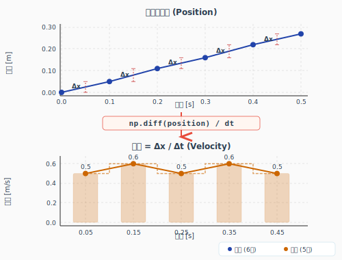

# 微積 —「変化を扱う道具」

---

## 連続と離散

**ゴールライン**: 連続と離散の違いが分かる。ロボットは離散で動くことが分かる。

### 連続値と離散値

- **連続**: 時間は途切れずに流れる。値はどこまでも細かくできる（数学の世界）
- **離散**: 一定間隔で区切って値を取る。飛び飛びの値しかない（コンピュータの世界）

ロボットのセンサは一定周期でしかデータを取れません。
モータも一定周期でしか命令を受け付けません。

**ロボットは離散でしか動けない。**

Δ（デルタ）は「1つ前との差分」を意味します。Δt なら「前回との時間の差」。

### 連続の微積は「イメージしにくい」

連続の微積で躓きやすいのは:
- Δt→0 って、ゼロで割り算できないのでは？
- 「限りなくゼロに近いけどゼロではない何か」が現実でイメージしにくい
- ε-δ論法で厳密に定義される（大学で出てきます）

高校の微積で引っかかるのはだいたいここです。

### 離散なら四則演算で済む

離散の世界では Δt は 0 にならない。実際の時間刻み（0.01秒とか）です。

**だから、微分も積分も四則演算（足し算・引き算・掛け算・割り算）で出来ます。**

---

## 離散微分（差分）

**ゴールライン**: 「変化率 = 差分 / 時間刻み」が分かる。numpyで書ける。

### 微分とは

「今と前の差」を「時間の刻み」で割ったもの = 変化率。

```
速度 = 位置の変化量 / 時間の変化量
     = (x[k] - x[k-1]) / Δt
     = Δx / Δt
```

引き算と割り算。これだけです。

### 具体例: エンコーダから速度を求める

```python
import numpy as np

# エンコーダの位置データ（0.1秒刻みで記録）
dt = 0.1  # [s]
position = np.array([0.0, 0.05, 0.11, 0.16, 0.22, 0.27])

# 微分（差分）→ 速度
velocity = np.diff(position) / dt
print(velocity)  # [0.5, 0.6, 0.5, 0.6, 0.5]
```

`np.diff()` が差分（引き算）を計算してくれます。

<!-- fig_discrete_diff.svg: 位置データと差分による速度の図 -->


---

## 離散積分（台形）

**ゴールライン**: 「累積 = 値 × 時間刻みの足し算」が分かる。numpyで書ける。

### 積分とは

速度を時間で足し合わせると、移動距離になります。
グラフで見ると「面積を足す」操作です。

台形近似: 隣り合う2点の平均 × 時間刻み = 台形の面積

```
距離 ≈ Σ (v[k] + v[k+1]) / 2 × Δt
```

掛け算と足し算。これだけです。

### 具体例: 速度から移動距離を求める

```python
# 速度データ（0.1秒刻み）
dt = 0.1
velocity = np.array([0.0, 0.5, 0.5, 0.5, 0.5, 0.0])

# 積分（台形）→ 総移動距離
distance = np.trapz(velocity, dx=dt)
print(f"総移動距離: {distance:.2f} m")  # 0.20 m

# 累積積分 → 時刻ごとの位置
position = np.cumsum(velocity) * dt
print(position)  # [0.0, 0.05, 0.10, 0.15, 0.20, 0.20]
```

### 微分と積分は逆操作

- 微分: 位置 → 速度（変化率を求める）
- 積分: 速度 → 位置（変化を累積する）

```python
# 位置 → 微分 → 速度
velocity = np.diff(position) / dt

# 速度 → 積分 → 位置（に戻る...はず）
position_reconstructed = np.cumsum(velocity) * dt
```

ただし、離散近似なので完全には戻りません。微小な誤差が出ます。

---

## dt の工学的意味

**ゴールライン**: dtがサンプリング周期であり、更新式の時間刻みであることが分かる。

### 数学のdtと工学のdt

| | 数学 | 工学 |
| -- | ---- | ---- |
| dt | 極限の中の微小量（0に近づける） | サンプリング周期（0.01秒とか） |
| 存在 | 概念上の存在 | 実際に測れる時間 |
| 値 | 0に限りなく近い | 固定値（設計で決める） |

### 更新式

ロボットの制御で最も基本的な式:

```
x[k+1] = x[k] + v[k] * dt
```

「今の位置 + 速度 × 時間刻み = 次の位置」

これは積分の離散版です。ロボットの状態更新はすべてこの形になります。

```python
# 位置の更新
dt = 0.01  # 10ms周期
x = 0.0
v = 0.5    # 0.5 m/s

for step in range(100):
    x = x + v * dt
    print(f"t={step*dt:.2f}s, x={x:.3f}m")
# → t=1.00s, x=0.500m
```

### dtの選び方

- dt が小さい → 精度が高いが、計算が多い
- dt が大きい → 計算は少ないが、精度が落ちる
- 実際のセンサ/モータの周期に合わせることが多い

詳しい話は大枠3で出てきます。ここでは「dtは設計で決める」が伝わればOK。

> **大学チラ見せ**: 連続の理論がないと離散近似の精度が保証できません。
> 大学で連続微積（極限、εδ、テイラー展開等）をやるのはそのためです。
> 離散で「だいたいこう」と分かったうえで、連続の理論を学ぶと「だからこの近似が使えるのか」と繋がります。

---

## 大学で躓きやすいポイント

ε-δ論法（極限の厳密な定義）が主役になります。
離散の直感が通じない厳密さを要求されます。

「変化率 = 差分÷時間」「面積 = 掛けて足す」という離散の直感があると、
連続の理論が「この直感を無限に細かくしたものなんだ」と捉えられます。

## 今は分かってなくて当然

- 連続微積の計算方法（置換積分、部分積分）
- テイラー展開
- εδ論法

離散の「変化量÷時間」「面積の足し算」が分かっていればOKです。

---

**次のレッスン**: → #23 ホイールオドメトリ (`03_engineering_computation/02_wheel_odometry`)
